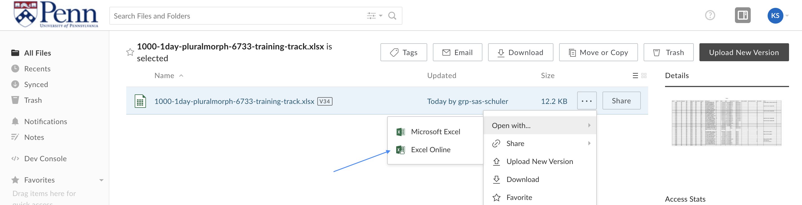
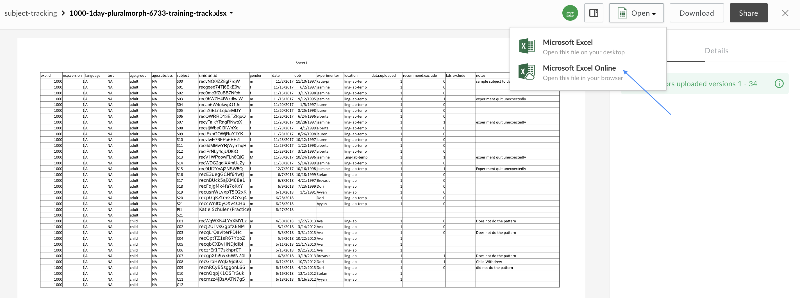

# How to access lab files

Our lab stores and edits files in the cloud using [Penn+Box](https://upenn.account.box.com/login). Penn+Box is free to members of the University of Pennsylvania community.  To request access to the lab files, first make sure you have access to your Penn+Box account [https://upenn.account.box.com/login]() (you can create a Penn+Box account if you don't already have one), then email Katie an access request using your Penn+Box associated email.

## What files will I have access to?
The lab has six folders in Penn+Box: ChildLangLab-Shared, ChildLangLab-Sandbox, ChildLangLab-IRB, ChildLangLab-Consents, ChildLangLab-Protocols, and ChildLangLab-Research.  You will be granted access to view and print all of these files, but some folders have restricted access permissions, so you may be prevented from downloading, deleting, and/or editing some files.

## How should I access these files?
All files should be accessed in the cloud at [Penn+Box Online](https://upenn.account.box.com/login).  When accessed in the cloud, Box allows for [real-time collaboration](https://www.youtube.com/watch?v=4PGxWpyU1os) on Word, Excel, and PowerPoint documents, so lab members can edit the same files simultaneously without overwriting each other or losing data.

To edit a Word, Excel, or Powerpoint document, you can do one of two things:

##### (1) Navigate to the document you want to open, click the three dots `...`, click `Open with...`, and then click `Excel Online`.

##### (2) Click on the document you want to edit to preview it,

## How do I edit files?
If you have editing priveledges, please
## Lab files: the 6 folders
### ChildLangLab-Shared
### ChildLangLab-Sandbox
### ChildLangLab-IRB
### ChildLangLab-Consents
### ChildLangLab-Protocols
### ChildLangLab-Research

Folder | Permissions | Content
--- | --- | ---
ChildLangLab-Shared | Lab Manager = `Editor` | Contains our shared Files
ChildLangLab-Sandbox | `editor` |
ChildLangLab-Research | `viewer uploader` |   
