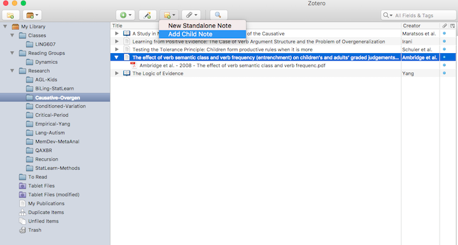
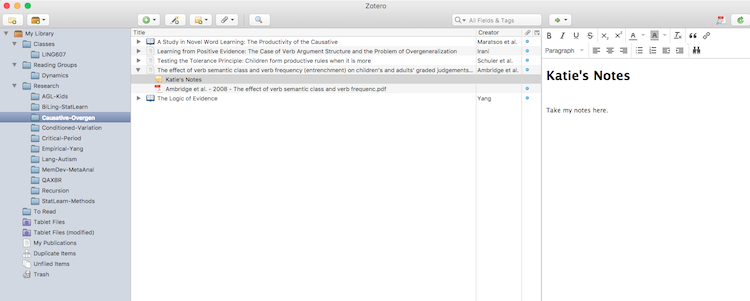
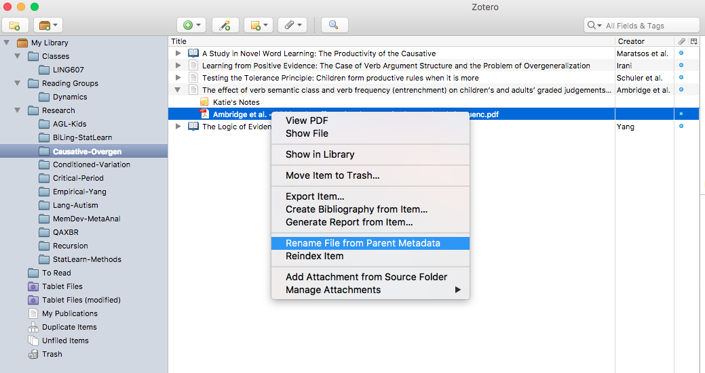

# How to do a Lit Review

> last updated: June 22, 2018

Our lab uses [Zotero](https://www.zotero.org/) to organize our literature and keep notes on our readings.  The lab has a single shared Zotero account that is synced across all lab computers.

Papers related to our research projects are organized by study series (e.g. `Empirical-Yang`).  

## Adding a source to Zotero

[Information on adding files can be found here.](https://www.zotero.org/support/getting_stuff_into_your_library)

There are a number of ways to add items to Zotero.  Our lab's preferred method is to add items via a web browser.  This requires that (1) you are on a lab computer and (2) a [Zotero Connector](https://www.zotero.org/download/) is installed for the browser you are using.

The Zotero Connector will automatically find bibliographic information on web pages you visit.  For example, if you are reading a journal article online, the Zotero Connector's save button on your browser bar will change to an icon of a journal article.  When you press this button, the paper will automatically be added to the lab's Zotero.

## Taking notes in Zotero

[Information on taking notes in Zotero can be found here.](https://www.zotero.org/support/notes)

To take notes on a particular paper, click on the paper's entry in Zotero, select the sticky-note button from the menu bar, and select 'Add Child Note'.  This associates the note with the paper and stores them together.

A side bar will open containing a text editor.  Title your note with your name and take whatever notes you like.

## Best practices

#### 1. Title notes with your name
All notes should be titled with your name so we know who took the notes.  If you are making notes on the same paper as someone else, you should create a separate note titled with your name.

#### 2. Summarize notes at the top
It is the lab's practice to create a brief summary of the article at the very beginning of the note (we also call this the [TL;DR](https://en.wikipedia.org/wiki/Wikipedia:Too_long;_didn%27t_read) section).

#### 3. Find and include the PDFs
Try to locate the PDFs that go with your bibliography entry. This might require searching via the [Penn Library](http://www.library.upenn.edu/).  When you include a PDF, make sure that the PDF is a child of the bibliography entry.  This means that the PDF should appear only when you "expand" the entry by clicking on the arrow.  

Here are two examples to illustrate what this means.  The `.pdf` file for the article *Testing the Tolerance Principle...* is correct. The .pdf file placement for the book section *The Acquisition of Agreement Morphology...* is not correctly placed (it is also incorrectly named; see next section).

#### 4. Rename PDFs from meta-data
All PDFs should conform to the same naming convention.  To ensure this, right-click on the item and select 'Rename file from Parent Meta-data' from the drop-down menu.  

