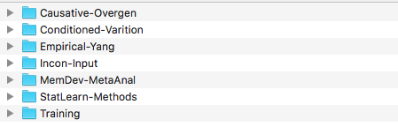
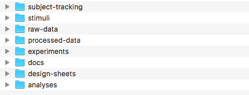

# Guidelines > Documentation

These are the general guidelines we follow for documenting and managing our research.

## Project management with Twist

We manage all of our research projects via [Twist](https://twist.zendesk.com/hc/en-us).  Twist is a web-based project management application that allows teams to work together toward accomplishing projects.  If you are new to twist, you can read the onboarding documentation here:

- [What is twist?](https://twist.zendesk.com/hc/en-us/articles/115003654609-What-is-Twist-)
- [Getting started for new users](https://twist.zendesk.com/hc/en-us/articles/115003645585-Getting-started-for-new-users)  

### How we use Twist

#### General and Support channels

We have two main channels in Twist: `General` and `Support`.  Our `General` channel is meant for lab-wide communication and announcements.  Things like welcoming new lab members, lab meeting updates, and other lab news.  Our `Support` channel is meant to be used when lab members have questions or to talk about general recruiting projects and events, etc.

#### As a lab notebook

We also use Twist as a lab notebook.  Each series of studies has a channel, and each experiment within that series has it's own thread in the channel.  All communications about an experiment should be made on this single thread, so we know exactly where to look for decisions that have been made about a particular study.

## Research folder

### Why this folder is so important

The `Research` folder contains all of the **official** files associated with the lab's experiments.  These files are **permanent** (we keep them **forever**).  Years from now, if someone wanted to see the materials or raw data from a particular study, we would need to send these files to them.  Because they are so important, there are very strict guidelines on what you can store in this folder and how.

### File organization system

The `Research` folder is organized by study series:

Within each study series, files are organized by **type** (NOT by sub-experiment).  Over the years, I have found this to be a more intuitive way for me to find things.  Looking for an experiment design sheet? It's in the design-sheet's folder.  Looking for the raw data for an experiment? It will be in the raw-data folder.  This also drastically simplifies the folder structure.  There is a single document or single sub-folder for each experiment within each of the folders shown below.  There are no other files in any other place.

This is **very important** because all of our data analysis scripts are based on this organization. Failing to store files according to this system will **break all of our data analysis scripts**.

### Naming conventions

Within each of these folders, there is a single file or sub-folder for each individual experiment.  All files and folders begin with the experiment id, the collection that the experiment belongs to, followed by a descriptive title in all lower-case with `-` as the separator:

- `EXPID-collection-descriptive-title`

This ensure that (1) when sorted alphabetically, the files will arrange by ID number, (2) that whenever a file is opened or shared, the filename makes it absolutely clear what it is you are looking at (e.g. there are not a million files named "data"), and (3) searching by EXPID allows you to find all files related to a given experiment.

Collections of experiments can be identified by the first name in the experiment title, and sub-collections can be identified by the experiment id number (`EXPID`).  

### What to save in each folder

Each folder has its own unique constraints.  The guidelines for what can be saved in each folder are below.

#### `subject-tracking`

- contains a single `.csv` file for each experiment and is appended with `-track.csv` (e.g. `0160-empiricalyang-9noun-hfrule-child-track.csv`)

#### `stimuli`

- contains a single **folder** for each experiment appended with `-stims` (e.g. `0160-empiricalyang-9noun-hfrule-child-stims`)
- inside this folder are all of the stimuli for the experiment arranged in sub-folders labeled by file type (e.g. `conditions`, `sounds`, `images`, `movies`, etc.)
- may also contain a Word document called `instructions-text.docx` which are the instructions provided to the participant during the experiment.

#### `raw-data`

- contains a single **folder** for each experiment appended with `-raw-data` (e.g. `0160-empiricalyang-9noun-hfrule-child-raw-data`)
- inside this folder are all of the raw data for the experiment (one file or folder per subject)
- subject data folders are named: `SID-YEAR-MONTH-DAT-HHMMSS` (e.g. `C01-2016-06-17-100307`)
- subject data files are named `SID-YEAR-MONTH-DAY-HHMMSS-datatype.csv` (e.g. `C01-2016-06-17-100307-exposure.csv`)

#### `processed-data`

- contains a single **folder** for each experiment appended with `-processed-data` (e.g. `0160-empiricalyang-9noun-hfrule-child-processed-data`)
- inside this folder are all of the processed data for the experiment.  This may be:
    - an empty text file, indicating that no processed data exists
    - one or more files with data that has been manipulated in some way (e.g. preprocessed, transcribed, coded, etc.)

#### `experiments`

- contains a single **folder** for each experiment appended with `-exp` (e.g. `0160-empiricalyang-9noun-hfrule-child-exp`)
- inside this folder are all of the experiment code and files including:
    - `change-log.txt`: a record of small changes made to the experiment code
    - stimuli folders where necessary (e.g. `images`, `conditions`)
    - at least one file containing the experiment script (e.g. `run-exp-v1.py` or `run-exp-v1.html`)
    - possibly a `yaml` parameter file containing the parameters for a given experiment.
- NOTE: While I manage code for full experiment paradigms on [github](https://github.com/kschuler), I find this to be overkill for every single experiment.  Often an experiment uses an existing paradigm with no changes to the code (or very minor changes).  All available experiment paradigms are stored on [github](https://github.com/kschuler) and can be downloaded via our [Experiment Library](../experiment-library/exp-lib-intro.md).

#### `docs`

- contains a single **folder** for each experiment appended with `-docs` (e.g. `0160-empiricalyang-9noun-hfrule-child-docs`)
- inside this folder are any auxiliary documents that we want to keep forever, but do not belong anywhere in the remaining folder architecture.  Often these are things like:
    - Data sheet templates for when we record things by hand.
    - Call for participants/recruitment procedures
    - Notes from the experiment.

#### `design-sheets`

- contains a single excel workbook for each experiment appended with `-design.xslx` (e.g. `0160-empiricalyang-9noun-hfrule-child-design.xslx`)
- a **single** file is very important, so there are not several different excel files and notes containing the experiment design.  A single file with a worksheet for each aspect of the design is more than sufficient to contain the details of each experiment.

#### `analyses`

- contains a single **folder** for each experiment appended with `-analysis` (e.g. `0160-empiricalyang-9noun-hfrule-child-analysis`)
- inside this folder are two additional files:
    - the `R` markdown file and the `html` file it generates
